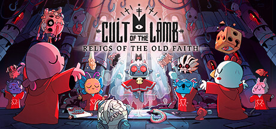

# Cult of QoL Collection
<br>

## What (more will be added over time)

- Removes intros.
- Cheese the fishing mini-game. (No need to press anything apart from the initial cast).
- Remove button clutter from main menu (Twitch, Roadmap, Discord, Bug Report)

## Requirements

Release BepInEx 5.4.21 · https://github.com/BepInEx/BepInEx/releases/tag/v5.4.21

## Installation

- BepInEx gets extracted into the main Cult of the Lambs directory - i.e.  "...steamapps\common\Cult of the Lamb\"
- Run the game once to generate configs and folders.
- Place the mod DLL inside the "...steamapps\common\Cult of the Lamb\BepInEx\plugins" folder.
- Config will be located in "...steamapps\common\Cult of the Lamb\BepInEx\config" after running the game once with the mod installed.

## Configuration
```
com.p1xel8ted.CultOfTheLamb.CultOfTheLambMods.cfg

## Settings file was created by plugin p1xel8ted's Cult of the Lamb mods! v1.0
## Plugin GUID: com.p1xel8ted.CultOfTheLamb.CultOfTheLambMods

[General]

## Enable/disable this mod.
# Setting type: Boolean
# Default value: true
Mod Enabled = true

## Skip splash screens.
# Setting type: Boolean
# Default value: true
Skip Intros = true

## Fishing mini-game cheese.
# Setting type: Boolean
# Default value: true
Cheese Fishing Mini-Game = true

## Removes credits/road-map/discord buttons from the menu.
# Setting type: Boolean
# Default value: true
Remove Extra Menu Buttons = true
```
